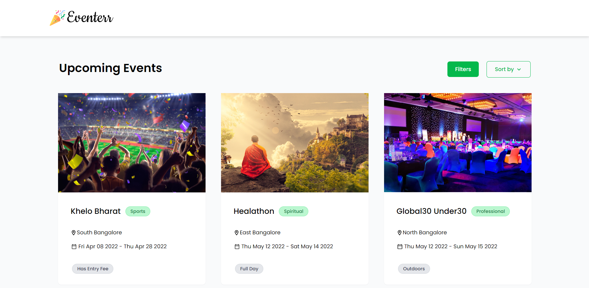
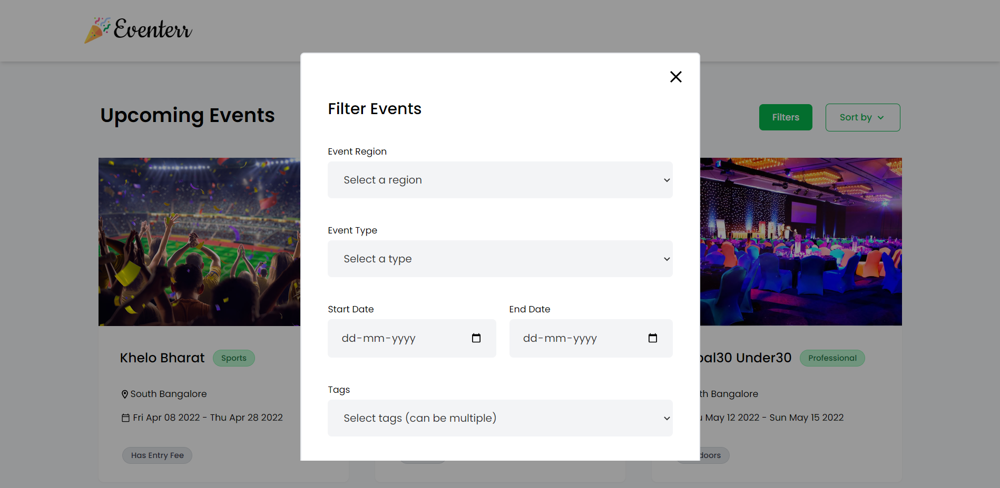
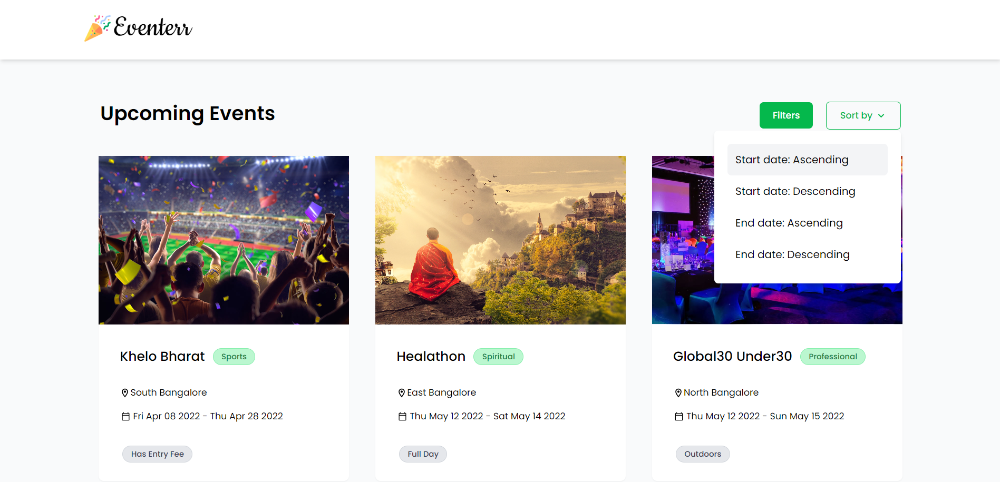

# Eventerr

A simple app that fetches data about events from an API and displays it. Events can then be filtered based on their region, type, tags and start and end dates. Events can also be sorted according to their start and end dates.
 
 

### Home page (shows all events)

 
 

### Filters modal

 
 

### SortBy dropdown

 
